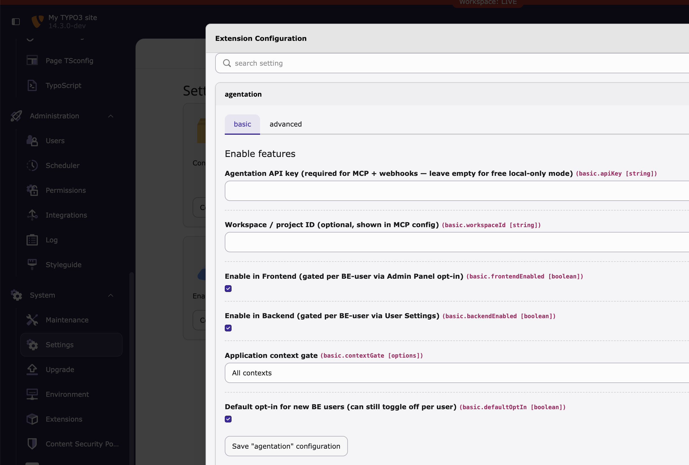

# EXT:agentation — Agentation for TYPO3 v14

Visual UI annotations for AI coding agents — right inside your TYPO3 frontend **and** backend.
Wraps the [`agentation`](https://www.agentation.com/) npm package so users can click elements,
annotate, and share structured context (CSS selectors, file paths, computed styles, user
feedback) with Claude Code, Cursor, or any MCP-capable agent.

## Features mapped from agentation.com

| Agentation feature | How this extension surfaces it |
| --- | --- |
| Element annotation toolbar | Loaded in FE + BE only when global and per-user switches allow it; position configurable |
| Hover previews / frame pausing / text selection | Provided by upstream `agentation@^3` bundle |
| Markdown export | Native upstream feature |
| MCP (Model Context Protocol) server | BE module renders pre-filled `.mcp.json` snippet, one-click copy |
| Webhooks | Configurable webhook URL in extension config, forwarded to toolbar init |
| API key / workspace ID | Extension configuration (install tool) |
| Framework-agnostic | Vanilla Vite bundle, zero React/Vue/Angular assumptions |

## Requirements

- TYPO3 ^14.0
- PHP ^8.2
- `typo3/cms-adminpanel` (bundled with v14)
- Node 20+ for the build step (only needed at install time / when updating)
- No TYPO3-side Vite integration extension needed — the built-in `ViteAssetResolver` reads `Resources/Public/Vite/manifest.json` directly.

## Install

```sh
composer require webconsulting/agentation
cd vendor/webconsulting/agentation   # or your extension path
npm install
npm run build
```

`npm run build` writes hashed assets + `manifest.json` into
`Resources/Public/Vite/`. The PHP side reads the manifest at request time, so
you only need to rebuild when upgrading `agentation` on npm.

## Configuration

Open **Admin Tools → Settings → Extension Configuration → agentation**.



### Basic tab

| Key | Type | Default | Purpose |
| --- | --- | --- | --- |
| `apiKey` | string | _empty_ | Agentation API key. Leave empty for free local-only mode (copy-paste markdown). Required for MCP + webhooks. |
| `workspaceId` | string | _empty_ | Workspace / project ID shown in the MCP snippet and sent to the toolbar. |
| `frontendEnabled` | boolean | ✓ | Global on/off for the FE toolbar. Still gated per BE-user via User Settings and Admin Panel opt-in. |
| `backendEnabled` | boolean | ✓ | Global on/off for the BE toolbar. Still gated per BE-user via User Settings → Agentation tab. |
| `contextGate` | options | `Development` | `Development`, `Development and Testing`, or `All contexts`. Prevents production leaks. |
| `defaultOptIn` | boolean | ✗ | Whether new BE users see the toolbar on by default (they can still toggle off). Tick this to skip the per-user opt-in step during initial setup. |

### Advanced tab

| Key | Type | Default | Purpose |
| --- | --- | --- | --- |
| `toolbarPosition` | string | `bottom-right` | `bottom-right` / `bottom-left` / `top-right` / `top-left`. |
| `webhookUrl` | string | _empty_ | Forwarded to the toolbar; annotations POST here with an `Authorization: Bearer <apiKey>` header if set. |
| `additionalOptions` | JSON string | _empty_ | Raw JSON merged into the toolbar's props. Escape hatch for upstream features (e.g. `{"enableDemoMode": true}`). |

### Where the screenshot lives

Save it as `Documentation/Images/extension-configuration-basic.png` inside the extension directory. The README links to it relatively so it also renders on GitHub.

## Frontend: Admin Panel section

When a BE user is authenticated in the frontend, the application context matches
the gate, and their frontend User Settings switch is enabled, a new
**Agentation** section appears in the TYPO3 Admin Panel. It exposes:

- **Show toolbar on this page** — per-session opt-in
- **Toolbar position** — override extension default
- **Annotation scope** — `frontend` (ignore the admin panel chrome) or `frontend+adminpanel`

No toolbar ever ships to anonymous visitors. The gate is:

```
contextGate passes  AND  BE user session  AND  frontend user setting enabled  AND  admin panel section toggled on
```

## Backend: User Settings switch

Each BE user gets an **Agentation** tab under **User Settings → Personal data** with:

- Enable toolbar in backend
- Enable toolbar in frontend (used alongside the Admin Panel opt-in)

The switches are stored in TYPO3 v14's `be_users.user_settings` JSON field
with `be_users.uc` as migration fallback. A saved off/hidden value is explicit:
the toolbar assets are not injected, the frontend Admin Panel module reports
off, and the backend widget proxy refuses widget-originated calls for that user.

`defaultOptIn` is only the seed for users who have never saved these settings.
Once a user changes either checkbox, their saved value wins.

## Backend module

A module under **System → Agentation** (admin-only) shows:

- Pre-filled `.mcp.json` snippet with one-click copy
- Status: API key set, bundle built, context allowed, FE/BE global toggles
- Stored annotations from the MCP server and browser-local Agentation storage
- Link to agentation.com

The module itself remains available to admins for setup and cleanup. The
same-origin widget proxy at `/typo3/ajax/agentation/api/proxy` is per-user
gated: if **Enable toolbar in backend** is off, widget calls receive `403`.

## TYPO3 service wiring

The extension uses TYPO3's Symfony DI container for services that need
constructor arguments. `Configuration/Services.yaml` keeps services private by
default and only exposes TYPO3 entrypoints such as backend controllers and the
Admin Panel module.

The Admin Panel module is registered as a public service and receives the
extension configuration service, the Admin Panel configuration service, and the
per-user toolbar settings service through constructor injection. This is
intentional: `UserToolbarSettingsService` depends on `ConfigurationService`, so
it must not be instantiated manually with `GeneralUtility::makeInstance()` from
Admin Panel code. Keeping the module DI-driven makes the frontend Admin Panel
gate use the same per-user settings logic as the backend asset injector and
widget proxy.

## MCP — yes, and here's how

The `agentation` npm package ships an MCP server. Any agent that supports MCP
(Claude Code, Cursor, Windsurf, Zed, Continue, Cline…) can connect to it and
receive annotations in real time instead of copy-paste.

1. Open the **Agentation** backend module.
2. Copy the shown JSON into your agent's MCP config:
   - **Claude Code** — `~/.claude/mcp.json` (or project `.mcp.json`)
   - **Cursor** — Settings → Features → MCP
   - **Windsurf / Zed / Continue** — equivalent MCP servers section
3. Reload your agent. It now has a tool like `agentation__get_annotation`.
4. Click annotate in the toolbar, add a note — your agent can ask clarifying
   questions and resolve the feedback against the codebase directly.

Example (also at `.mcp.json.example`):

```json
{
  "mcpServers": {
    "agentation": {
      "command": "npx",
      "args": ["-y", "agentation-mcp", "server"],
      "env": {
        "AGENTATION_API_KEY": "your-api-key",
        "AGENTATION_WORKSPACE": "your-workspace-id"
      }
    }
  }
}
```

API key and workspace are only needed when you want multi-device sync or team
sharing. The toolbar itself works locally without them.

## Framework-agnostic (from the host page)

The `agentation` npm package is a React component under the hood. To keep
the integration framework-agnostic **from the TYPO3 site's perspective**,
Vite bundles agentation's React runtime + React DOM + our glue into a
single self-contained ES module (~547 KB, ~138 KB gzipped).

- Your TYPO3 site does **not** need React, Vue, or Angular.
- If it already ships React for something else, our bundle runs its own
  isolated instance via `createRoot` into a detached `#typo3-agentation-root`
  container — no version conflicts, no hydration issues.
- Toolbar config is passed through an inert JSON data island at
  `#typo3-agentation-config`, so the TYPO3 v14 CSP does not need an inline
  JavaScript nonce or hash for the config payload.
- TYPO3-specific visual overrides are injected by the entrypoint, not by
  editing upstream package CSS. The collapsed dark-mode toolbar button gets a
  subtle outer ring so the circular Agentation icon remains visible on dark
  backend and frontend surfaces.
- No custom elements, no shadow DOM, no coupling to host frameworks.

## TYPO3 entrypoint behavior

`Build/Sources/agentation.js` is the TYPO3-specific browser entrypoint that
wraps the upstream `agentation` component. The built Vite asset does the
following before mounting React:

- Reads toolbar configuration from the inert JSON data island
  `#typo3-agentation-config`.
- Stops immediately when the injected payload contains `enabled: false`.
- In backend scope, namespaces Agentation-owned `localStorage` keys by TYPO3
  module path and record id, so annotations from one record do not appear on
  another record using the same module route.
- Wires a same-origin `BroadcastChannel` named `typo3-agentation` so deletes
  from **System → Agentation** remove stale browser-local annotations in open
  widget instances.
- Patches `fetch()` only when PHP provides both `endpoint` and `proxyUrl`.
  Requests to the configured sync endpoint are then routed through TYPO3's
  same-origin backend proxy to avoid HTTPS-to-HTTP mixed-content blocking.
- Installs the backend keyboard guard described below before the upstream
  toolbar registers its own document-level shortcuts.
- Injects a small `#typo3-agentation-style-overrides` stylesheet for
  TYPO3-specific presentation tweaks, including the dark-mode contrast ring
  around the collapsed circular toolbar button.
- Mounts the toolbar into a detached `#typo3-agentation-root` container.

## Backend keyboard behavior

The upstream toolbar provides single-letter shortcuts such as `L` for layout
mode, `P` for pause, `H` for markers, `C` for copy, `X` for clear, and `S` for
send. In the TYPO3 backend, the integration guards those shortcuts before the
toolbar mounts: when focus is inside a TYPO3 input, textarea, select,
contenteditable area, or textbox-like editor, the key event stays with TYPO3.

This prevents Agentation from swallowing normal typing in backend forms while
keeping shortcuts available when focus is outside editable fields.

## Security notes

- Toolbar never loads for anonymous FE visitors. It requires a valid BE session.
- `contextGate` blocks production by default.
- Per-user off/hidden switches are enforced before asset injection. For the
  frontend Admin Panel module and backend widget, the same switch is also
  enforced by DI-wired TYPO3 services.
- API key is rendered into the BE module only — never exposed to the FE unless
  the FE user is the same BE user (which they are, by design, since the
  toolbar only runs when BE session is active).

## License

GPL-2.0-or-later
